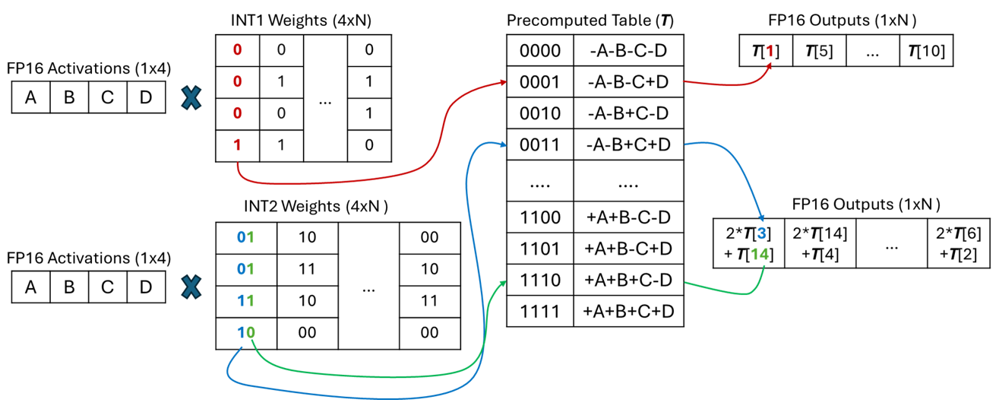

# LUT-based Mixed-Precision GEMM

## Basic Information

On resource-constrained devices, such as embedded systems, running deep 
learning models, especially LLMs, is highly computationally expensive. Low-bit 
quantization is a popular solution to reduce memory consumption. However, when 
weights are quantized below 8 bits, performing matrix multiplication between 
the weight matrix and an FP16 activation matrix requires dequantization to a 
common precision, as hardware lacks native support for mixed-precision matrix 
multiplication (mpGEMM). Some recent research suggests using lookup tables 
(LUTs) to replace dequantization, further reducing computational overhead.



## Problem to Solve

- Support mixed-precision matrix computation (weight INT1~4) where activation 
tensors are limited to FP16.
- Implement **precomputed lookup table (LUT)-based computation** to accelerate 
low-bit matrix multiplications.
- Enable the LUT to reside in the fastest on-chip memory and parallel lookup.
- Preliminary estimates suggest that vendor libraries such as MKL or 
Accelerate can be **10× to 1000×** faster than naive GEMM implementations. 
This project aims to evaluate how closely LUT-based methods can approach these 
performance levels in mixed-precision low-bit GEMM.

## Prospective Users

This project will benefit:

1. **Embedded AI Developers**: Those optimizing AI models for deployment on 
edge devices.
2. **Data Scientists**: Users who need optimized inference on diverse hardware 
setups.
3. **Academia & Research Labs**: Those investigating numerical optimization 
and quantization techniques.

## System Architecture

### Lookup Table Component

- Precomputes and stores the LUT in the on-chip memory.
- The LUT precomputes and stores the accumulation results of all possible 
combinations of quantized low-bit weights (INT1~INT4) and FP16 activation 
vectors.
- Accelerates LUT lookups using SIMD instructions (Intel AVX2 or AVX-512).
- Allows users flexibility to:
  - Automatically generate LUT based on provided activation vectors and 
selected weight bit-width (INT1~4).
  - Load and reuse previously generated LUTs for reproducibility and 
efficiency.

### GEMM Component

- Implements the matrix multiplication algorithm in C++.
- Supports three computation modes:
  - LUT-based GEMM (using precomputed LUT)
  - Naive GEMM (pure FP16 computation)
  - Vendor-optimized GEMM (Intel MKL)
- Supports mixed-precision matrix computation (weight INT1~4, activation FP16).
- Generation of test matrices (weights, FP16 activations, and biases).

### Post-Processing Component

- Performs bias addition to GEMM outputs.
- Provides common neural-network activation functions:
  - ReLU  
  - Sigmoid  
  - Tanh  
  - Linear (identity function, i.e., no activation)  

### Accuracy & Error Analysis Component

- Provides methods to measure numerical accuracy of computations.
- Includes methods for error analysis (e.g., Mean Squared Error, Maximum 
error).
- Compares results with reference FP16 matrix multiplication for accuracy 
verification.

### Quantization & Dequantization Utility Component

- Provides functions to quantize and dequantize FP16 values to/from INT1~4.
- **For quantization:**  
  ```quantized = round(fp16 / scale) + zero_point```
- **For dequantization:**  
  ```fp16 = (quantized - zero_point) * scale```

### Benchmarking Component

- The benchmarking Component will compare latency between LUT-based GEMM, 
vendor libraries, and naive dequantization-based methods.

## API Description

```python
import mpGEMM

# === Initialization ===
# Initialize GEMM engine (options: "lut", "mkl", "naive")
gemm = mpGEMM(backend="lut", use_simd=True)

# === Data Generation ===
# Generate test data: quantized weights, FP16 activations, FP16 biases
fp16_weights = gemm.generate_matrix((128, 128), dtype="fp16")
weights = gemm.quantize(fp16_weights, bit_width=4, scale=0.1, zero_point=0)
activations = gemm.generate_matrix((128, 128), dtype="fp16")
bias_vector = gemm.generate_bias(128, dtype="fp16")

# Dequantize weights from INT4 to FP16
dq_weights = gemm.dequantize(weights, bit_width=4, scale=0.1, zero_point=0)

# === LUT Management ===
# Generate and manage Lookup Table (LUT)
lut = gemm.generate_lut(bit_width=4, activations=activations)
gemm.save_lut("lut_int4_fp16.bin")
gemm.load_lut("lut_int4_fp16.bin")

# Inspect LUT details
lut_info = gemm.inspect_lut()
print(lut_info)
# Example output:
# {
#   "lut_size": "64KB",
#   "bit_width": 4,
#   "activation_shape": [128, 128],
#   "num_entries": 16
# }

# === Computation ===
# Perform LUT-based mixed-precision GEMM
output = gemm.matmul(weights, activations, weight_bit_width=4)

# Optional: add bias and activation function
biased_output = gemm.add_bias(output, bias_vector)
activated_output = gemm.activation_function(biased_output, activation="relu")

# === Benchmarking ===
# Benchmark different computation methods
gemm.benchmark(methods=["lut", "mkl", "naive"], num_runs=10)

# === Analysis ===
# Compute reference FP16 result for accuracy verification
fp16_output = gemm.matmul(fp16_weights, activations, weight_bit_width=16)

# Measure numerical error compared to FP16 reference
error = gemm.measure_error(fp16_output, output, method="mse")
print(f"Mean Squared Error: {error.mse}")
```

## Engineering Infrastructure

- **Automated Build System:** Uses CMake to set up the C++ build system and 
setuptools to build Python packages.
- **CI**: GitHub Actions for automated testing and benchmarking. The CI 
pipeline includes:
  - **Correctness tests**: Ensures numerical accuracy of matrix multiplication 
and quantization/dequantization methods.
  - **Performance benchmarks**: Compares LUT-based GEMM with traditional 
dequantization-based methods and vendor libraries (MKL).
- **Testing Framework**: Uses Google Test for C++ unit tests and pytest for 
Python.
- **Version Control:** Uses Git for version management, with all development 
processes submitted to the GitHub repository.
- **Documentation**: GitHub README.md.

## Schedule


| Week  | Tasks & Test Plan |
|-------|-------------------|
| **Week 1 (3/17)** | Research background, setup project repo, configure testing framework. <br>**(Testing Plan)** Choose and configure testing framework (pytest for Python, GoogleTest for C++). |
| **Week 2 (3/24)** | Implement naive GEMM, setup CI for correctness testing. <br>**(Testing Plan)** Validate GEMM correctness across multiple matrix sizes and INT bit-widths (1~4). |
| **Week 3 (3/31)** | Implement Lookup Table (LUT) component.<br>**(Testing Plan)** Validate LUT correctness (ensure lookup values match mathematical expectations). |
| **Week 4 (4/7)** | Optimize LUT lookup using SIMD (AVX2/AVX-512). <br>**(Testing Plan)** Benchmark and correctness tests: Validate performance gains and ensure no errors introduced by SIMD optimization. |
| **Week 5 (4/14)** | Implement Quantization/Dequantization Component, optimize LUT memory management. <br>**(Testing Plan)** Measure LUT memory efficiency, verify memory access performance and correctness. Verify correctness of quantization/dequantization operations and numerical accuracy. |
| **Week 6 (4/21)** | Integrate vendor libraries (MKL), implement GEMM Component. <br>**(Testing Plan)** Verify correctness across all computation modes and ensure correct interaction with vendor libraries. |
| **Week 7 (4/28)** | Implement Post-processing Component, integrate API. <br>**(Testing Plan)** Unit tests: Confirm correctness of each activation function and bias addition. Verify integration between Python API and C++ backend. |
| **Week 8 (5/5)** | Develop benchmarking component. <br>**(Testing Plan)** Benchmark tests: Measure latency for varying matrix sizes, bit-widths, and backends. |
| **Week 9 (5/12)** | Implement Accuracy & Error Analysis Component. <br>**(Testing Plan)** Measure MSE and maximum error relative to FP16 reference implementation. |
| **Week 10 (5/19)** | Final optimizations and benchmarking. <br>**(Testing Plan)** Final validation tests: Ensure all previously implemented tests pass and performance results are consistent. |
| **Week 11 (5/26)** | Finalize documentation, prepare report, and presentation. <br>**(Testing Plan)** Documentation review: Verify clarity, completeness, and accuracy of final documentation and presentation materials. |

## References

- **DeepGEMM:** 
[Paper](https://openaccess.thecvf.com/content/CVPR2023W/ECV/papers/Ganji_DeepGEMM.pdf)
- **T-MAC:** [Paper](https://arxiv.org/html/2407.00088v1)

